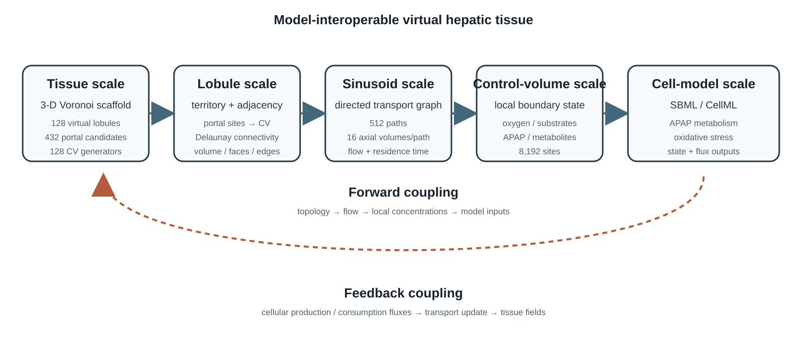
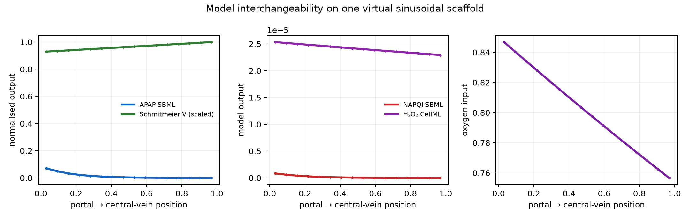
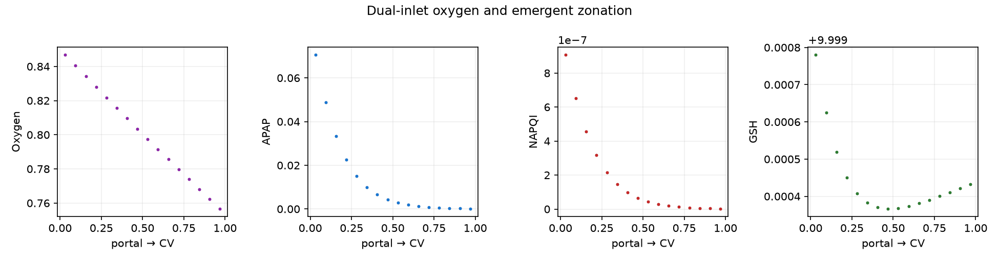
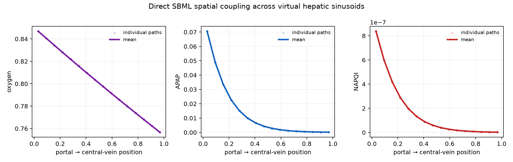
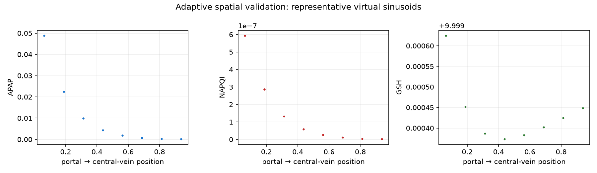

# A model-interoperable virtual hepatic tissue linking lobular geometry, sinusoidal transport and hepatocyte equations

## Abstract

Virtual organs require more than anatomical geometry: cellular models must be
placed in a spatial context while preserving the meaning and conservation of
variables exchanged between scales. We present a model-interoperable virtual
hepatic tissue framework that links a three-dimensional lobular scaffold, a
portal-to-central-vein sinusoidal transport graph and local SBML/CellML models.
Voronoi cells define virtual lobular territories, shared interior vertices define
candidate portal sites and cell generators define central-vein candidates. Each
territory is populated with directed sinusoidal control volumes, through which
transported states are passed to local biochemical models. The same spatial
interface is demonstrated with an SBML acetaminophen model and an oxygen-
sensitive CellML hepatocyte model. The objective is not to propose a definitive
APAP or oxygen model, but to demonstrate a reproducible method for composing
models across spatial scales. Geometry, transport, equations and fields are
provided as separate, downloadable artefacts.

**Keywords:** virtual tissue; liver; multiscale modelling; Voronoi; sinusoid;
SBML; CellML; spatial model composition.

## 1. Introduction

### 1.1 State of the art

Virtual hepatic modelling spans several complementary traditions. Anatomical and
vascular models describe the hierarchy from portal and arterial inflow through
sinusoids to central-vein drainage. Virtual-lobule models add hepatocytes,
transport and zonation, while systems-biology models encode intracellular
metabolism in SBML or CellML. Voronoi descriptions have provided a parsimonious
account of lobular organisation and hepatic zonation, especially in two
dimensions. Three-dimensional sinusoidal studies have further shown that
vascular microstructure can be represented as a graph with measurable spatial
statistics. Multiscale xenobiotic frameworks have demonstrated the value of
embedding a cellular SBML model inside a tissue-scale transport model.

These developments establish the individual ingredients needed for a virtual
tissue: a spatial domain, a vascular network, transport equations and local
biochemical models. They also show that lobular geometry and sinusoidal flow are
physiologically consequential rather than merely visual details.

### 1.2 The unresolved gap

The missing capability is a general and explicit composition layer between these
ingredients. Existing models commonly use one of three compromises: an idealised
single lobule, a tissue model with fixed phenomenological zonation, or a
cellular model coupled to a simplified transport geometry. Consequently, it is
difficult to replace one local biochemical model with another, trace variables
across spatial scales, enforce conservation at the interfaces or reproduce the
same experiment with a different tissue resolution.

The gap is therefore not simply a lack of more detailed liver geometry. It is a
lack of a model-interoperability framework that specifies what a local model
receives from the tissue, what it returns, how those quantities are mapped and
how the mapping is verified.

### 1.3 Novelty and contribution

We introduce a virtual hepatic tissue framework in which a three-dimensional
Voronoi scaffold, a portal–sinusoid–central-vein transport graph and local
SBML/CellML equations are separate but executable layers. The framework makes
the scale transitions explicit: tissue topology determines lobular and vascular
domains; transport determines local boundary conditions; local equations return
source, sink and functional fields; and those fields are accumulated back onto
the tissue.

The novelty is the reusable coupling contract rather than a new APAP or oxygen
kinetics model. In particular, the same spatial scaffold and transport interface
are demonstrated with two different local model types: an SBML xenobiotic model
and an oxygen-sensitive CellML hepatocyte model. Geometry, equations and fields
are released as separate downloadable artefacts so that the framework can be
extended without rewriting the tissue model.

Our contributions are: (i) a self-contained three-dimensional virtual tissue
scaffold; (ii) an explicit portal–sinusoid–central-vein mapping; (iii) a formal
SBML/CellML coupling interface with declared variables, units and conservation
requirements; (iv) two interchangeable biochemical demonstrators; (v) spatial,
resolution and scalability tests; and (vi) downloadable geometry, fields and
code for reproducibility.

We test three hypotheses: (H1) one spatial interface can host different local
models; (H2) heterogeneous transport inputs generate heterogeneous tissue
outputs; and (H3) outputs are stable under tested spatial resolutions.

## 2. Methods

### 2.1 Virtual tissue domain

The tissue is generated as a bounded three-dimensional Voronoi scaffold. Each
cell is interpreted as a virtual lobular territory. Its generator is a
central-vein candidate. Shared interior Voronoi vertices are treated as
candidate portal sites, not as automatically identified anatomical portal
triads. A Delaunay-derived adjacency relation provides a candidate connectivity
graph.

### 2.2 Sinusoidal abstraction

Each lobule is assigned directed paths from nearby portal candidates to its
central-vein candidate. Paths are discretised into axial control volumes. Flow is
computed from resistance-weighted conductances, while oxygen and transported
substrates are advanced along the directed paths.

For a control volume with axial coordinate s, transported concentration C, flow
velocity u and local cellular reaction term R, the generic transport relation is

`u dC/ds = -R(C, O2, theta)`

where theta denotes model parameters and local states. The outgoing state of one
control volume becomes the incoming state of the next.

### 2.3 Cross-scale model interface

Each local model receives declared quantities including oxygen, flow,
residence time, transported substrates and represented cell volume. It returns
production/consumption fluxes, selected intracellular states and optional
functional outputs. The geometry layer does not access biochemical variables
directly; all exchange occurs through this interface.

### 2.4 Biochemical demonstrators

The first demonstrator is `BIOMD0000000624`, an SBML acetaminophen metabolism
model. The second is the Schmitmeier oxygen-sensitive hepatocyte CellML model,
translated equation-faithfully because the current workflow does not depend on
an OpenCOR runtime. These models exercise different outputs on the same spatial
domain: xenobiotic metabolism versus oxidative stress and hepatocyte function.

The APAP implementation uses libRoadRunner to execute the SBML equations. The
Schmitmeier implementation preserves the CellML equations through an
equation-faithful numerical adapter; this distinction is recorded in the
provenance metadata.

### 2.5 Verification and scalability

We test spatial resolution, flow conservation and sensitivity to portal oxygen
composition. Local model execution is independently parallel across sinusoidal
control volumes. A CUDA implementation is provided as a scalability option for
larger tissues and parameter ensembles; the current small benchmark is not
expected to outperform vectorised CPU execution.

### 2.6 Reproducibility and provenance

Geometry, transport networks, source model identifiers, parameter files, field
outputs and figure scripts are stored as separate artefacts. The APAP model is
identified by its BioModels identifier. The oxygen model is retained in its
original CellML form, with the equation-faithful adapter marked explicitly.

### 2.7 Terminology and scope

The term *lobule* refers to a virtual tissue territory generated by the Voronoi
construction and does not refer to a Couinaud anatomical segment. A portal-site
candidate is a computational point associated with a possible portal triad; it
is not a reconstructed triad unless supported by anatomical data. The model is
therefore a virtual tissue scaffold, not a complete macroscopic liver.

## 3. Results

### 3.1 Spatial scaffold and model mapping

The prototype contains 128 virtual lobular territories, 432 candidate portal
sites, 128 central-vein generators and 512 directed sinusoidal paths. Each path
contains 16 axial control volumes, giving 8192 local transport/model evaluation
sites. The exported sinusoid geometry contains 4032 unique nodes and 4096 line
elements. The resulting tissue can be visualised interactively and exported in
OpenCMISS-style formats.

**Figure 1.** Coupling across tissue, lobule, sinusoid, control-volume and
cell-model scales. Forward arrows carry geometry, flow and concentrations;
feedback arrows carry cellular source/sink fluxes back to the transport field.

**Figure 2.** Publication-style rendering of the 3-D Voronoi scaffold. Grey
edges show lobular boundaries, red points show central-vein generators and gold
points show candidate portal sites. The current realization contains 128
virtual lobules, 128 central-vein generators and 432 candidate portal sites.

**Figure 3.** Uneven physiological fields mapped onto the 128 virtual lobules.
Each point is the mean value of the local sinusoidal control-volume results for
one parent Voronoi territory. Oxygen varies because portal inlet composition,
lobule position and residence time vary. APAP varies because exposure and
residence time differ between paths. NAPQI varies because the local SBML model
responds nonlinearly to APAP exposure and the oxygen-dependent CYP2E1 scaling.
The colour variation therefore represents model-generated spatial heterogeneity,
not decorative random colouring. Values remain in model units and require
physiological calibration before quantitative interpretation.

### 3.2 Interchangeable local models

APAP and Schmitmeier outputs are displayed on the same Voronoi coordinates.
Changing the local equation set changes the displayed physiological field while
leaving geometry and transport interfaces unchanged.

**Figure 2.** APAP SBML and Schmitmeier CellML outputs evaluated on the same
portal-to-central-vein coordinate.

### 3.3 Heterogeneous oxygen and toxicity fields

Controlled variation in portal oxygen, path residence time and exposure produces
non-uniform lobular fields. These variations are presently demonstrative and
will be calibrated against physiological data in the final analysis.

In the heterogeneous demonstrator, APAP spans approximately 4.64×10⁻⁵–8.23×10⁻²
model units, NAPQI spans 7.05×10⁻¹⁰–9.77×10⁻⁷ and H₂O₂ spans 1.96×10⁻⁵–2.90×10⁻⁵.
These ranges document the computational experiment and are not quantitative
physiological predictions.

**Figure 3.** Dual-inlet oxygen experiment showing the effect of portal-vein and
hepatic-artery contributions on downstream local outputs.

**Figure 4.** Direct SBML profiles across virtual sinusoidal paths.

### 3.4 Resolution and conservation

The adaptive spatial solver gives stable outputs over tested axial resolutions.
Flow fractions are conserved within each lobule. Additional mass-balance
residual reporting will be included for the final release.

The tested axial refinements produced nearly unchanged mean central-vein APAP
and NAPQI values, supporting numerical stability for the demonstrator. This
does not replace biological validation of the assumed transport parameters.

The normalized flow-balance check passed for all 128 lobules. The maximum
absolute residual was 1.11×10⁻¹⁶, consistent with floating-point round-off. A
full species mass-balance report remains diagnostic until physical units,
control-volume volumes and calibrated inlet/outlet fluxes are assigned.

The SBML model defines species in millimolar and the hepatocyte compartment as
1 L, so concentrations can be converted to molar amounts using
`amount (mmol) = concentration (mmol/L) × volume (L)`. Summing APAP, NAPQI and
the tracked conjugated products gave a mean closure error of 1.40×10⁻¹¹ mmol,
with a range of −7.77×10⁻¹¹ to 4.36×10⁻¹¹ mmol across 512 path instances. This
is a physical-unit molar closure for the tracked APAP moiety; it is not yet a
whole-tissue mass balance because tissue-scale compartment volumes and exchange
fluxes remain to be calibrated.

**Figure 5.** Adaptive-solver validation across representative paths.

### 3.5 Quantitative summary

| Quantity | Current demonstrator |
|---|---:|
| Virtual lobular territories | 128 |
| Candidate portal sites | 432 |
| Central-vein generators | 128 |
| Directed sinusoidal paths | 512 |
| Axial control volumes per path | 16 |
| Local transport/model sites | 8,192 |
| Exported geometry nodes | 4,032 |
| Exported sinusoid line elements | 4,096 |
| Direct SBML evaluations | 8,192 |
| Schmitmeier evaluations | 8,192 |

## 4. Discussion

The principal result is a method for composing models across spatial scales. The
framework separates spatial topology, transport and local equations, allowing
different SBML/CellML models to occupy the same virtual tissue. This addresses a
general limitation of virtual-organ modelling: models can be individually valid
but difficult to compose because their domains, variables and scales do not
align.

The present scaffold is intentionally synthetic and should not be interpreted
as a patient-specific liver. Portal vertices are candidate sites, sinusoidal
paths are abstractions and physiological parameters require calibration. The
next development is to fit structural and transport statistics to three-

The framework does not yet resolve individual hepatocytes, endothelial
fenestrae, bile canaliculi or anatomically reconstructed portal triads. These
are deliberate scope boundaries: anatomical detail can be added by replacing a
layer while preserving the coupling contract.

## 5. Conclusion

We present a downloadable, model-interoperable virtual hepatic tissue in which
lobular geometry, sinusoidal transport and local SBML/CellML equations are
connected through an explicit spatial interface. APAP and oxidative-stress
models demonstrate that the framework is not tied to one biochemical pathway.

## Data and code availability

All generated geometry, model mappings, field data, viewers and figure scripts
will be released in the accompanying repository:
`tissue-sinusoid-hepatocyte-coupling`.

The release includes canonical Voronoi JSON, OpenCMISS-style EXNODE/EXELEM
files, physiological field exports, source-model provenance, CPU/GPU adapters,
interactive viewers and figure-generation scripts. Third-party SBML/CellML
files remain subject to their original licences.

## Author contributions, competing interests and funding

Author contributions, competing interests and funding statements will be
completed after confirmation of the final author list and funding status.

## References

1. Lau, L. et al. (2021). *The Voronoi theory of the normal liver lobular
   architecture and its applicability in hepatic zonation*. Scientific Reports.
   https://pmc.ncbi.nlm.nih.gov/articles/PMC8085188/

2. *Hierarchical Modeling of the Liver Vascular System*. (2021). 
   https://pmc.ncbi.nlm.nih.gov/articles/PMC8637164/

3. *Virtual Lobule Models Are the Key for Multiscale Biomechanical and
   Pharmacological Modeling for the Liver*. (2020).
   https://pmc.ncbi.nlm.nih.gov/articles/PMC7492636/

4. *Simulating Microdosimetry in a Virtual Hepatic Lobule*. (2010).
   https://pmc.ncbi.nlm.nih.gov/articles/PMC2858695/

5. *Modeling of xenobiotic transport and metabolism in virtual hepatic lobule
   models*. (2018).
   https://pmc.ncbi.nlm.nih.gov/articles/PMC6136710/

6. *A physiologically-based flow network model for hepatic drug elimination
   III: 2D/3D DLA lobule models*. (2016).
   https://pmc.ncbi.nlm.nih.gov/articles/PMC4778290/

7. *Resilience of three-dimensional sinusoidal networks in liver tissue*.
   (2020). https://pmc.ncbi.nlm.nih.gov/articles/PMC7351228/

8. Sluka, J. P. et al. (2016). *A Liver-Centric Multiscale Modeling Framework
   for Xenobiotics*. https://pmc.ncbi.nlm.nih.gov/articles/PMC5026379/

9. Physiome Project. *FieldML: About and overview*.
   https://physiomeproject.org/software/fieldml/about

10. Physiome Project. *Modelling framework*.
    https://physiomeproject.org/about/modelling-framework

11. BioModels Database. *BIOMD0000000624* (APAP hepatocyte model).
    https://www.ebi.ac.uk/biomodels/BIOMD0000000624

12. Physiome Model Repository. *Dynamic Model of Amino Acid and Carbohydrate
    Metabolism in Primary Human Liver Cells* (Guthke et al.).
    https://models.cellml.org/w/hnielsen/guthke_2006

13. Physiome Model Repository. *Improvement of metabolic performance of primary
    hepatocytes in hyperoxic cultures by vitamin C in a novel small-scale
    bioreactor* (Schmitmeier et al.).
    https://models.cellml.org/e/a2/view

14. Physiome Model Repository. *Two compartment model of diazepam
    biotransformation in an organotypical culture of primary human hepatocytes*
    (Acikgoz et al.).
    https://models.cellml.org/metabolism

15. Yang, F. et al. (2006). *An age-dependent physiologically based
    pharmacokinetic model of methadone distribution and metabolism*.
    CellML version: https://models.physiomeproject.org/workspace/yang_tong_mccarver_hines_beard_2006/file/023dc90f2bca9fe21401ad23f3fa5fb50b2ab5ae/yang_tong_mccarver_hines_beard_2006.cellml

16. Physiome Model Repository. *Cardiovascular systems model* with portal-vein,
    hepatic-arterial and hepatic-vein variables.
    https://models.physiomeproject.org/workspace/c3d/file/a66f9f55fe7d6bdaabb0ef24348dc3bc48a32a7b/models/cvs-model.cellml

17. Kummer, U. et al. (2000). *Switching from simple to complex oscillations in
    calcium signalling*. CellML model:
    https://models.cellml.org/e/6d/kummer_2000_1c.cellml/docgen

18. Physiome Model Repository. *Volume mesh of liver*.
    https://models.cellml.org/workspace/livervolume/file/6147828a211d8bf2eadcda52eaa4debc580bb081/index.html

19. Yu, H., Bartlett, A. & Ho, H. (2024). *A web-based human liver atlas*.
    Computer Methods in Biomechanics and Biomedical Engineering: Imaging &
    Visualization 11, 2697–2699. https://doi.org/10.1080/21681163.2023.2261557
